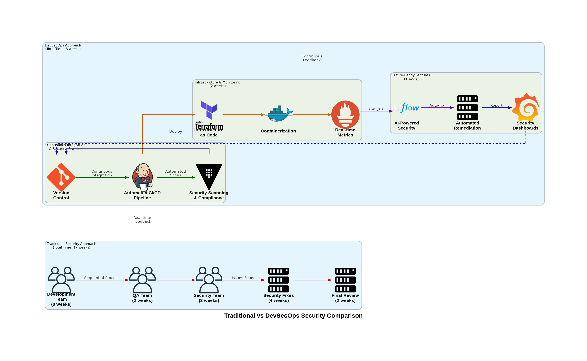

# Why DevSecOps Beats Traditional Security: A Comprehensive Guide

 Table of Contents
- [Introduction](introduction)
- [Technical Details: A Comparative Analysis](technical-details-a-comparative-analysis)
- [Real-Time Scenario](real-time-scenario)
- [Benefits and Best Practices](benefits-and-best-practices)
- [Implementation Differences](implementation-differences)
- [Challenges and Solutions](challenges-and-solutions)
- [Future Trends](future-trends)
- [Conclusion](conclusion)

 Introduction

The contrast between DevSecOps and traditional security approaches has become increasingly stark in today's fast-paced digital world. While traditional security operated as a separate, final-stage checkpoint, DevSecOps integrates security throughout the development lifecycle, fundamentally changing how organizations protect their applications and infrastructure.

 Technical Details: A Comparative Analysis

 Traditional Security
- Security checks performed at the end of development
- Manual security testing and reviews
- Siloed teams with minimal collaboration
- Linear, waterfall-style security process
- Reactive security measures

 DevSecOps
- Security integrated from day one
- Automated security testing and monitoring
- Collaborative teams with shared responsibility
- Iterative, continuous security process
- Proactive security measures

 Real-Time Scenario

 Banking Application Development Comparison

 Traditional Security Approach (17 weeks total)
1. Development team builds application (6 weeks)
2. Passes to QA team (2 weeks)
3. Security team reviews at the end (3 weeks)
4. Finds 25 vulnerabilities
5. Returns to development for fixes (4 weeks)
6. Repeat security review (2 weeks)

 DevSecOps Approach (8 weeks total)
1. Security requirements defined at start
2. Development with automated security checks (7 weeks)
3. Continuous security testing identifies issues immediately
4. Fixes implemented during development
5. Final security validation (1 week)

 Benefits and Best Practices

 Traditional Security Limitations
- ❌ Long security review cycles
- ❌ High cost of late-stage fixes
- ❌ Limited collaboration
- ❌ Delayed deployment
- ❌ Security as bottleneck

 DevSecOps Advantages
- ✅ Continuous security validation
- ✅ Early issue detection and fixes
- ✅ Shared security responsibility
- ✅ Faster time to market
- ✅ Security as enabler

 Implementation Differences

 Traditional Security Implementation
1. Development phase
2. Separate security testing
3. Manual vulnerability scanning
4. Compliance checks at the end
5. Documentation after completion

 DevSecOps Implementation
1. Security as Code
2. Automated security testing
3. Continuous compliance monitoring
4. Real-time vulnerability scanning
5. Automated documentation

 Challenges and Solutions

 Traditional Security Challenges
- Delayed feedback
- Resistance from security teams
- Limited automation
- Resource constraints
- Communication gaps

 DevSecOps Solutions
- Immediate feedback loops
- Cross-team collaboration
- Extensive automation
- Shared resources
- Continuous communication

 Future Trends

DevSecOps is evolving with:
- AI-powered security automation
- Shift-left security testing
- Zero-trust architecture
- Container security
- Infrastructure as Code security

 Conclusion

The comparison clearly shows that DevSecOps significantly outperforms traditional security approaches in speed, efficiency, and effectiveness. By integrating security throughout the development lifecycle rather than treating it as a final gate, organizations can deliver secure applications faster and more reliably.

Tags: #DevSecOps #TraditionalSecurity #SecurityTransformation #SecureSDLC #SecurityAutomation #ShiftLeft #SecOps #ModernSecurity